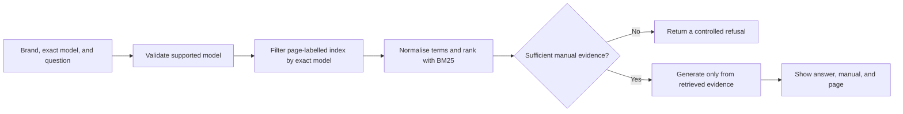

# Product

<!-- impeccable:product-schema 1 -->

## Platform

web

## Persona

The primary persona is a household owner or operator of a supported washing-machine model who needs a quick, trustworthy answer while standing near the appliance. The user can operate a web page but may not know the terminology used in a technical manual. A customer-support employee who needs a traceable source before escalation is a secondary persona. Course assessors are a review audience rather than the product's end users.

## Product Purpose

Washing Machine Manual Assistant lets a user choose an exact brand and model, ask a natural-language question, and receive either a grounded answer with the relevant manual page or a clear refusal when the manual does not support an answer.

## Positioning

The assistant filters by exact model before retrieval and requires manual evidence before answering. It is not a general appliance chatbot.

## Operating Context

The primary workflow is: select brand, select exact model, ask a question, read the answer, and inspect the cited official-manual evidence. The application is a Streamlit web interface backed by a local retrieval index and OpenRouter generation.

## Input

The user provides three values through the web interface:

1. A supported brand.
2. An exact model belonging to that brand.
3. A natural-language operating or troubleshooting question.

The exact model is required. The product does not infer a model from the wording of the question because visually similar error codes can have different meanings across manuals.

## Output

For a supported question, the product returns:

- A concise answer grounded in the selected manual.
- An evidence identifier.
- The official manual title and exact cited page.

If the model is missing or unsupported, or if the selected manual lacks sufficient evidence, the product returns a specific refusal instead of supplementing the answer with general knowledge.

## High-Level Product Architecture

Routing, retrieval, evidence gating, and refusal are local and deterministic. OpenRouter is called only after the evidence gate accepts the selected passages.

## Metrics Targeted

| Measure | Target | Reason |
| --- | ---: | --- |
| Retrieval Recall at 3 | At least 90% on answerable cases | The correct section must be available before generation can succeed. |
| Faithfulness review | Review 20 generated answers; at least 90% supported | A retrieved passage does not guarantee a grounded final answer. |
| Refusal and routing behaviour | 100% on defined safety-boundary cases | Unsupported requests must not produce an answer from another manual. |
| Cost per question | Measure and report | Hosted generation must remain practical for a public prototype. |

## Metrics Reached

| Measure | Recorded result |
| --- | ---: |
| Retrieval Recall at 3 | 35/35 (100%) |
| Answerable cases completed | 35/35 |
| Refusal and routing behaviour | 15/15 (100%) |
| Manually reviewed faithfulness | 20/20 (100%) |
| Total recorded provider usage | 37,055 tokens / USD 0.00575937 |
| Average estimated cost | USD 0.000115 per evaluation case; USD 0.000165 per generated answer |

These results apply to the fixed 50-case evaluation and should not be read as production accuracy. The evaluation design, result files, and limitations are documented in [`evaluation/README.md`](evaluation/README.md).

## Capabilities and Constraints

- Five supported model entries across Gaggenau, SMEG, and Zanussi.
- Official manual content is the only answer source.
- Exact-model filtering is mandatory before retrieval.
- Unsupported questions must produce a refusal.
- Original PDF manuals remain local and are not committed to GitHub.
- API credentials remain local in `.env` and must never be committed.

## Brand Commitments

- Product name: Washing Machine Manual Assistant.
- Preserve the custom washing-machine and graduation-cap logo in `assets/logo.svg`.
- Use a cool navy, blue, cyan, and white visual family.
- The interface should feel like a real appliance product experience, not a generic chatbot dashboard or a stack of cards.
- Typography follows Apple's native system stack: SF Pro on Apple devices, with Helvetica Neue and Arial as safe fallbacks elsewhere.

## Evidence on Hand

- Fixed manual catalogue: `data/manuals_manifest.csv`.
- Prebuilt retrieval index: `data/chunks.jsonl`.
- Data provenance and schema: `data/README.md`.
- Formal evaluation set and results under `evaluation/`.
- Evaluation method and limitations: `evaluation/README.md`.
- Official product imagery stored under `assets/machines/` with source pages documented in the repository.
- Existing desktop and mobile reference captures under `docs/images/`.

## Product Principles

1. Match the exact machine before searching.
2. Show the evidence a user can verify.
3. Refuse when the manual does not support an answer.
4. Keep technical evaluation details in project documentation rather than the main user answer.
5. Make the core question-and-answer workflow immediately understandable.

## Accessibility & Inclusion

Maintain keyboard focus visibility, readable contrast, responsive layouts, and a reduced-motion path for all nonessential animation.
