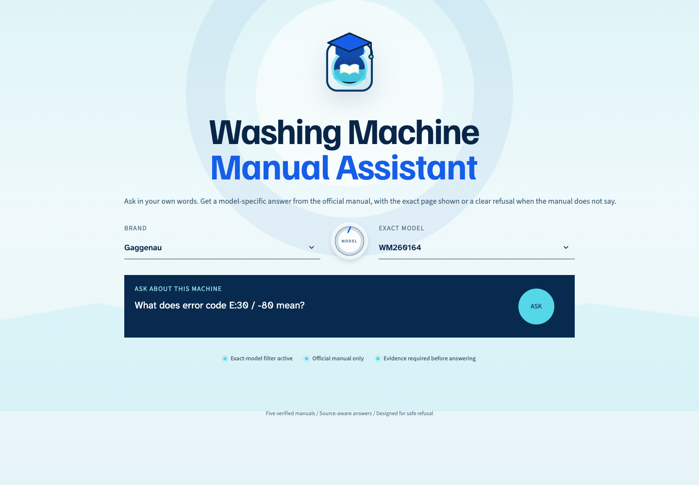
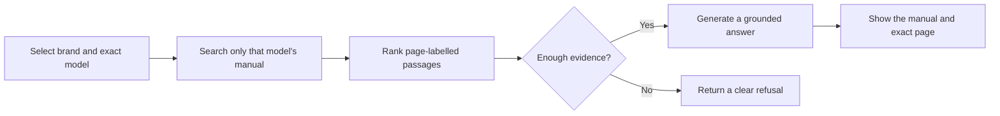
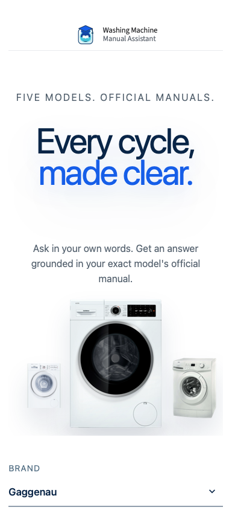

<div align="center">
  

  # Washing Machine Manual Assistant

  **Every cycle, made clear.**

  A model-specific RAG assistant that answers washing-machine questions from official manuals, cites the exact source page, and refuses when the evidence is insufficient.

  [](https://github.com/shirley830/washing-machine-manual-assistant/actions/workflows/tests.yml)
  
  
</div>



## Why this project exists

Washing-machine manuals are long, model-specific, and often difficult to search. A generic chatbot can easily mix instructions from different appliances or produce an answer that the selected manual never supported.

This project reduces that risk by selecting the exact machine **before retrieval**, searching only its official manual, and requiring evidence before an answer can be generated.

## What it does

| Capability | Behaviour |
| --- | --- |
| Exact-model retrieval | Filters by brand and model before ranking passages. |
| Verifiable answers | Every supported answer includes the official manual and page number. |
| Evidence-gated generation | The configured model receives only retrieved, model-specific evidence. |
| Safe refusal | Missing, unsupported, or weakly evidenced requests are refused instead of guessed. |
| Reproducible evaluation | Retrieval, generation, refusal, layout, and error states have automated checks. |

## How it works



The checked-in retrieval index is built from page-labelled manual passages. Retrieval uses a local BM25 keyword baseline with exact-model filtering. Answer generation uses a model selected through OpenRouter, but unsupported requests are rejected locally before any API call.

## Evaluation results

The fixed formal evaluation contains 50 questions: 35 answerable cases and 15 cases that should be refused or cannot be routed.

| Metric | Recorded result |
| --- | ---: |
| Retrieval Recall@3 | **35/35 (100%)** |
| Answer generation | **35/35** answerable cases |
| Refusal accuracy | **15/15 (100%)** |
| Manually reviewed faithfulness | **20/20 (100%)** |
| Recorded evaluation API use | 37,055 tokens / estimated USD 0.00575937 |

Detailed outputs are available in [`evaluation/formal_retrieval_results_50.csv`](evaluation/formal_retrieval_results_50.csv) and [`evaluation/formal_results_50.csv`](evaluation/formal_results_50.csv).

## Supported models

| Brand | Model | Manual source |
| --- | --- | --- |
| Gaggenau | WM260162CN | Official Gaggenau manual |
| Gaggenau | WM260164 | Official Gaggenau manual |
| Gaggenau | WM262700-26 | Official Gaggenau manual |
| SMEG | WM24UWH | Official SMEG manual |
| Zanussi | ZWG1120M | Official Electrolux/Zanussi manual |

The source URLs and local filenames are recorded in [`data/manuals_manifest.csv`](data/manuals_manifest.csv).

## Quick start

The repository includes the prebuilt model-labelled retrieval index at `data/chunks.jsonl`. The original PDF files are not required at runtime, so a fresh clone can run without rebuilding the index.

```bash
git clone https://github.com/shirley830/washing-machine-manual-assistant.git
cd washing-machine-manual-assistant

python3 -m venv .venv
source .venv/bin/activate
pip install -r requirements.txt

cp .env.example .env
# Add your private OPENROUTER_API_KEY to .env.

streamlit run streamlit_app.py
```

Open the local address printed by Streamlit, normally `http://localhost:8501`.

> [!IMPORTANT]
> Keep `.env` private. It is ignored by Git and should never be committed.

## Interface

The web interface supports keyboard navigation, mobile layouts, visible focus states, and reduced-motion preferences. Users select a brand and exact model, ask a natural-language question, and receive either an evidence-backed answer or a clear refusal.

<div align="center">
  
</div>

## Run the pipeline

Rebuilding the checked-in index is optional. To rebuild it, place the five manifest-listed PDFs in `data/manuals/`, activate the virtual environment, and run:

```bash
python src/ingest.py
```

The command replaces `data/chunks.jsonl`. PDF manuals remain excluded from Git, while the small deterministic index is committed so reviewers can run the project directly.

Retrieve the three most relevant passages for one model:

```bash
python src/retrieve.py \
  --brand Gaggenau \
  --model WM260164 \
  --question "What does error code E:30 / -80 mean?"
```

Generate an evidence-grounded answer with a page citation:

```bash
python src/generate.py \
  --brand Gaggenau \
  --model WM260164 \
  --question "What does error code E:30 / -80 mean?"
```

API usage is logged locally to `outputs/api_usage.jsonl`. Requests rejected by the evidence gate do not call the API.

## Testing

Run the retrieval, answer/refusal, formal-evaluation, and Python regression checks:

```bash
python evaluation/run_smoke_retrieval.py
python evaluation/run_smoke_answering.py
python evaluation/run_formal_evaluation.py
python -m unittest discover -s tests -p "test_*.py"
```

Run the browser end-to-end tests:

```bash
npm install
npx playwright install chromium webkit
npm run test:e2e:all
```

The browser suite starts the real Streamlit application and a deterministic local OpenRouter-compatible server. It checks model-specific answers, exact-page citations, refusal behaviour, empty input, authentication errors, stale-answer clearing, desktop alignment, mobile overflow, and touch-target size. It makes no paid API calls.

The same checks run automatically through GitHub Actions on every push and pull request.

## Project structure

```text
washing-machine-manual-assistant/
├── assets/                 Logo, fonts, and documented product imagery
├── data/
│   ├── chunks.jsonl        Prebuilt page-labelled retrieval index
│   └── manuals_manifest.csv
├── docs/images/            Desktop and mobile interface previews
├── evaluation/             Fixed datasets, runners, and recorded results
├── src/
│   ├── ingest.py           PDF extraction and chunk creation
│   ├── retrieve.py         Exact-model filtering and BM25 retrieval
│   ├── answer.py           Evidence gating and extractive answering
│   └── generate.py         Grounded OpenRouter generation
├── tests/                  Prompt and browser regression tests
├── streamlit_app.py        Web interface
└── requirements.txt        Pinned Python dependencies
```

## Design and reproducibility notes

- [`PRODUCT.md`](PRODUCT.md) records the product purpose, users, constraints, and evidence policy.
- [`DESIGN.md`](DESIGN.md) records the interface system, responsive behaviour, typography, and motion rules.
- [`docs/tradeoff_analysis_draft.md`](docs/tradeoff_analysis_draft.md) documents retrieval and system-design trade-offs.
- Official product-image source pages are documented in [`assets/machines/SOURCES.md`](assets/machines/SOURCES.md).

The original manuals, `.env`, virtual environment, generated usage logs, and installed packages remain local and are intentionally excluded from version control.
